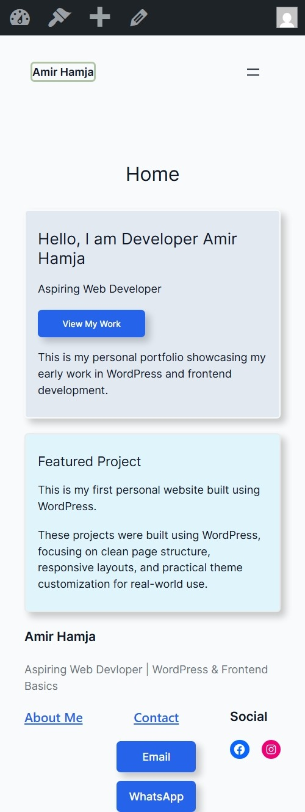

# Personal Portfolio Website

## Description
This is my first personal portfolio website built using HTML5 and CSS3.  
It showcases my basic web development skills and project structure.

## Features
- Multi-page static website
- Semantic HTML structure
- External CSS styling
- Responsive layout (mobile-friendly)
- Clean folder organization

## Pages
- Home
- About
- Portfolio
- Contact

## Technologies Used
- HTML5
- CSS3

## Live Demo
https://hamja-dev.github.io/my-portfolio/

## Purpose
This project is part of my web development learning roadmap.  
It serves as the foundation before moving into WordPress and AWS.

# Personal Portfolio (WordPress)

This is my first WordPress-based portfolio website.

## Screenshot

## What I Practiced

- Working with the WordPress Block Editor (Gutenberg)
- Creating and managing templates and block patterns
- Building reusable and synced patterns
- Structuring pages for clarity and maintainability
- Ensuring consistent navigation and layout across the site
- Using HTML anchor links and buttons for internal navigation and calls to action
- Implementing `mailto:` links for email contact
- Adding social media icons with external links

## Pages
- Home
- About
- Contact
- Portfolio

## Goal
Build a clean, maintainable foundation before adding plugins or advanced features.

## Author
Amir Hamja